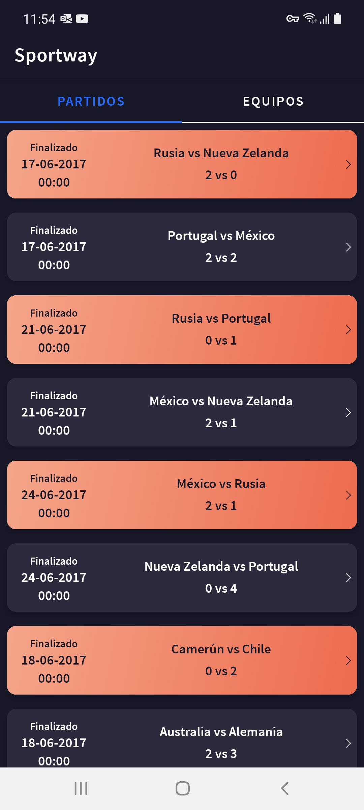
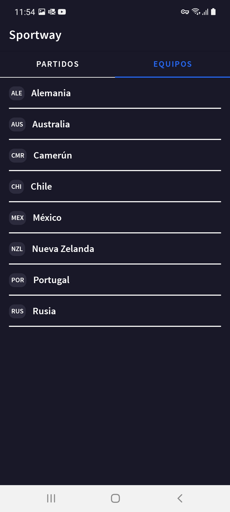
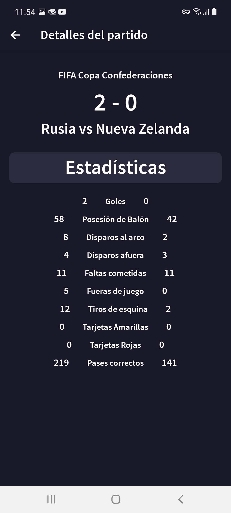

# Sportway

### Contenido
* [Introduccion](#introduccion)
* [Conceptos aplicados](#conceptos-aplicados)
* [Herramientas utilizadas](#herramientas-utilizadas)
* [Screenshots](#screenshots)

### Introduccion
Sportway es una aplicación móvil nativa que permite visualizar información detallada de distintos partidos que se hayan jugado, estén 
jugando o incluso que se vayan a jugar, así como también, los equipos de fútbol disponibles.
Toda la información es obtenida de servicios proporcionados por la api de FZ Sports.

NOTA: Para seguridad, se mantuvo el token de primera autenticación guardado localmente.

### Conceptos aplicados
* Clean Architecture (basado en las 3 capas principales de presentation, domain y data)
* Dependency injection
* Patrón MVVM para la capa de presentación
* Patrón Repository para la capa de data

### Herramientas utilizadas
* Hilt para DI
* Corrutinas y flows para la programación asíncrona
* Retrofit2 para la comunicación con la API
* JUnit4 y MockK para el Unit testing

### Screenshots
* Lista de partidos

* Lista de equipos

* Detalles de partido
